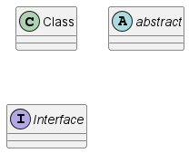
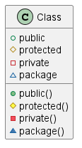
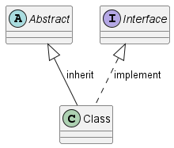

% Modélisation du réseau des bibiliothèques de Paris en Java
% Hadouin LEROY
% November 11, 2022

## 1. Représentez une classe, une classe abstraite et une interface dans un diagramme UML de classe

## 2.Rappelez la différence entre une classe et une classe abstraite

Une classe abstraite est une classe qui ne peut pas être instanciée. Elle sert de modèle pour les classes qui en héritent. Elle peut contenir des méthodes abstraites qui doivent être implémentées dans les classes qui en héritent.

## 3. Rappelez la différence entre une classe abstraite et une interface

Une classe abstraite peut contenir des méthodes abstraites et des méthodes non abstraites. Une interface ne peut contenir que des méthodes abstraites. Une classe abstraite peut avoir des attributs, une interface non.

## 4. Rappelez les symboles utilisés pour représenter les différents types de visibilité de la programmation orientée objet dans un diagramme UML de classe.

| **Caractère** | **Icône pour le champ**                                 | **Icône de la méthode**                                  | **Visibilité** |
| ------------- | ------------------------------------------------------- | -------------------------------------------------------- | -------------- |
| `-`           |          |          | `private`      |
| `#`           |        |        | `protected`    |
| `+`           |           |           | `public`       |
| `~`           |  |  | `package`      |

## 5. Rappelez les types de flèches utilisées pour représenter l’héritage et l’implémentation dans un diagramme UML de classe  
- L’héritage se traduit par un trait continu allant de la classe fille à la classe0
  mère (abstraite ou non), et se termine par un triangle.
- L’implémentation d’interface se traduit par un trait pointillé allant de la
  classe à l’interface, et se termine par un triangle.

## 6. Représentez le diagramme UML de classe permettant de modéliser cette version simplifiée du réseau des bibliothèques de Paris.  

## 7. Implémentez les différentes composantes du diagramme UML en Java en prenant soin de bien organiser votre code.

_Voir code dans `./BibliJava/`_
